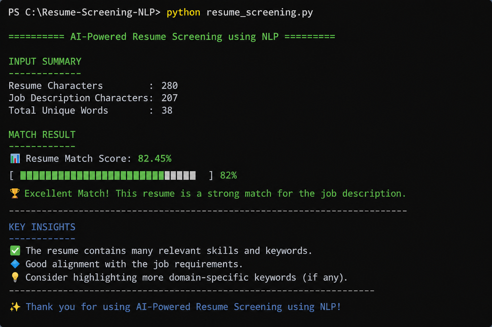

AI-Powered Resume Screening using NLP

Project Overview

This project compares a resume with a job description using Natural Language Processing (NLP).

It uses:

- TF-IDF Vectorization
- Cosine Similarity
- Python
- Scikit-learn

to calculate how well a resume matches a job description.

---

Example Output

Resume Match Score: 82%

Excellent Match ✅

---

Technologies Used

- Python
- Scikit-learn
- NLP Basics
- TF-IDF
- Cosine Similarity

---

Future Improvements

- PDF Resume Upload
- Streamlit Web App
- Skill Gap Detection
- ATS Score Prediction
- LLM-based Resume Optimization

---

📷 Sample Output

---

Author

Devi Shankar
